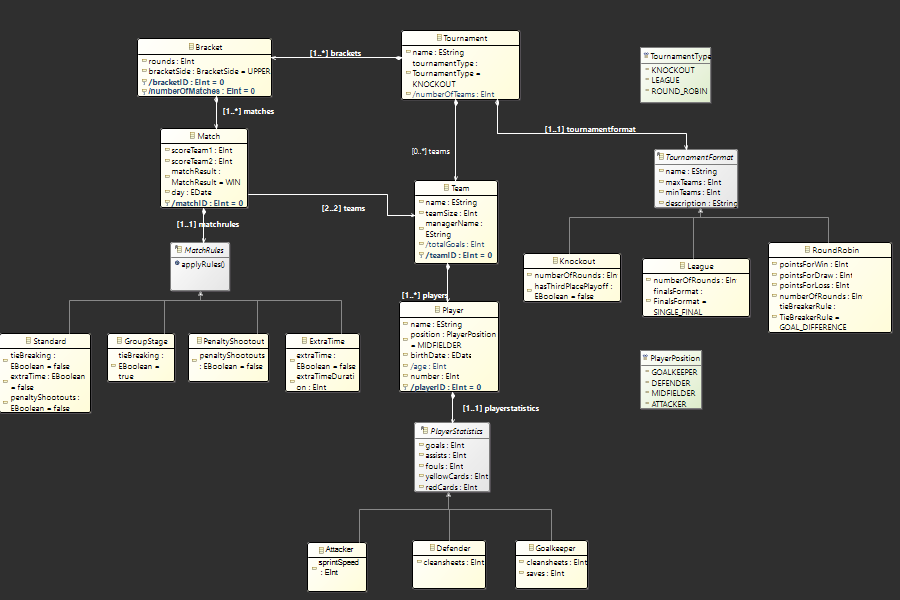
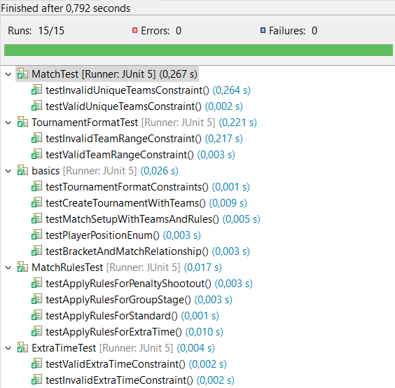
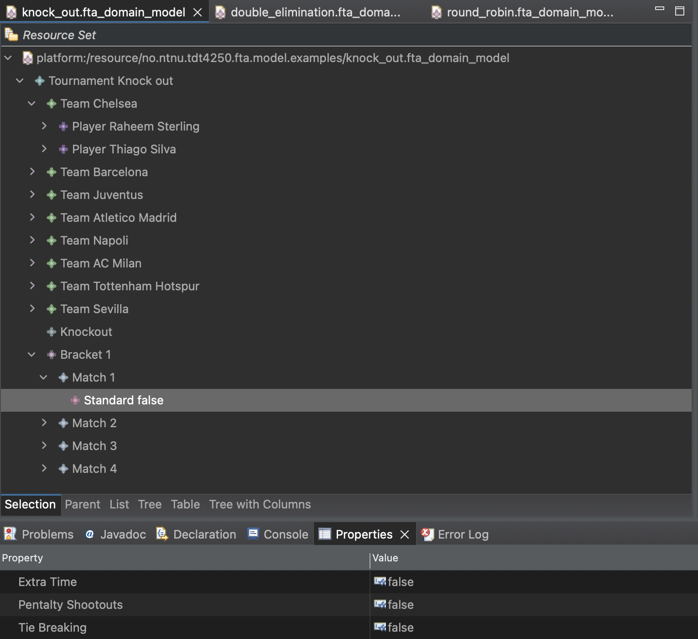
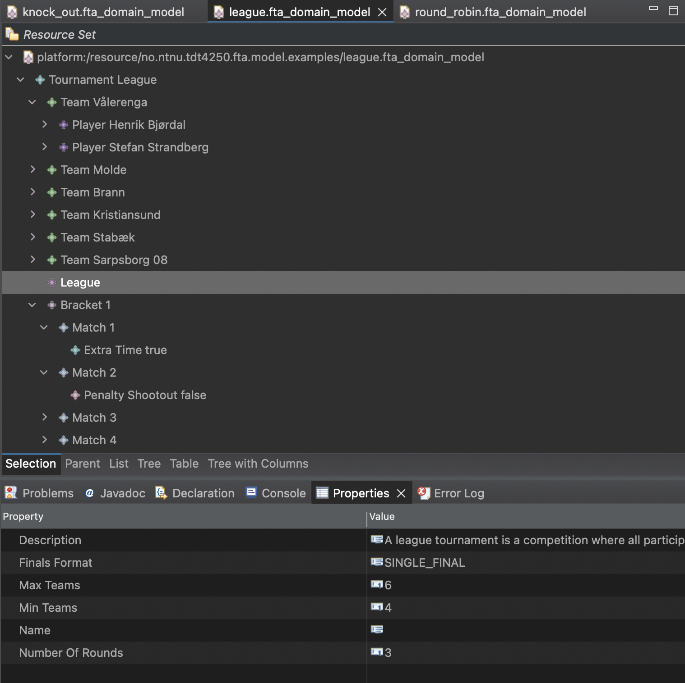
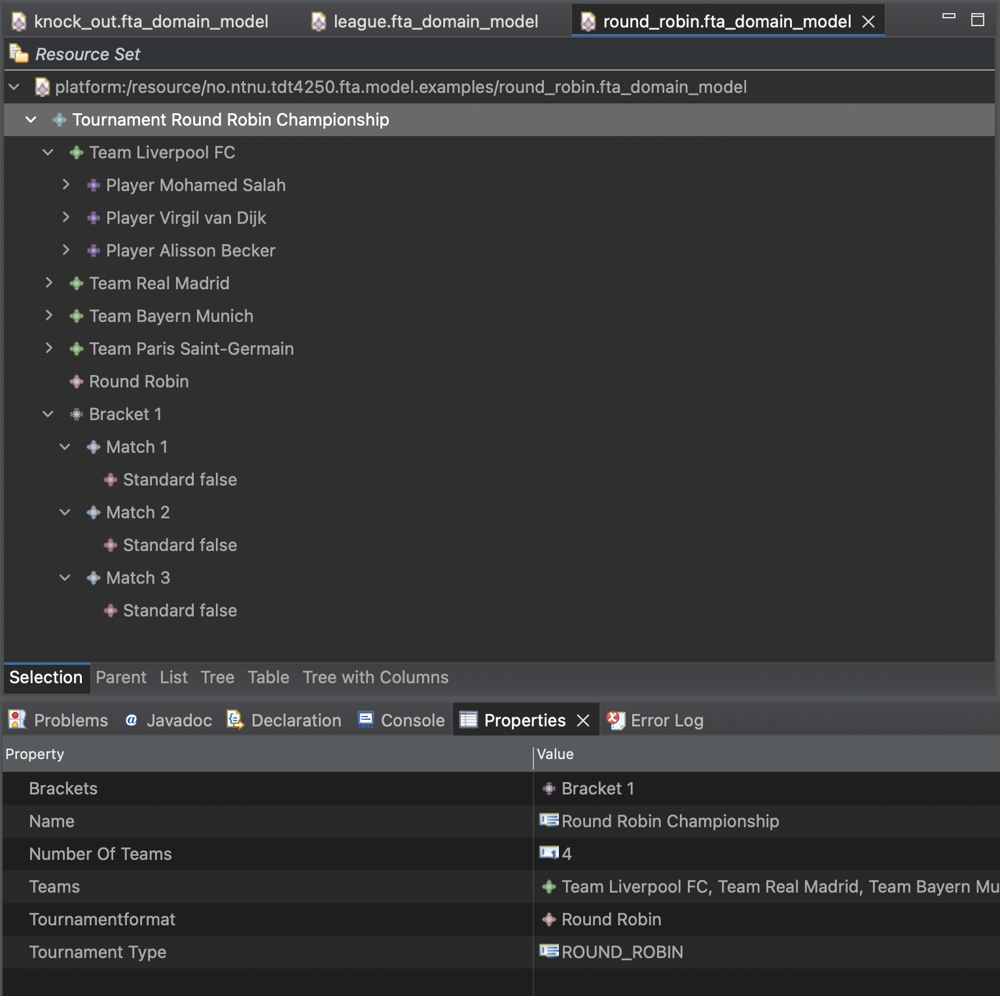
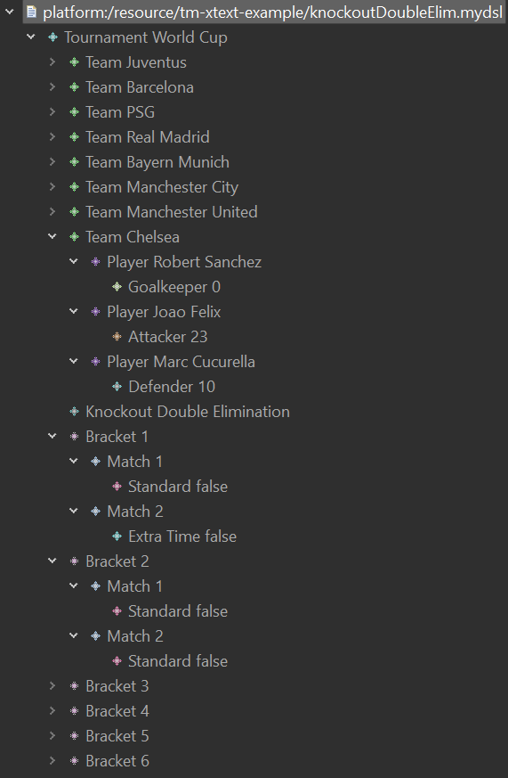
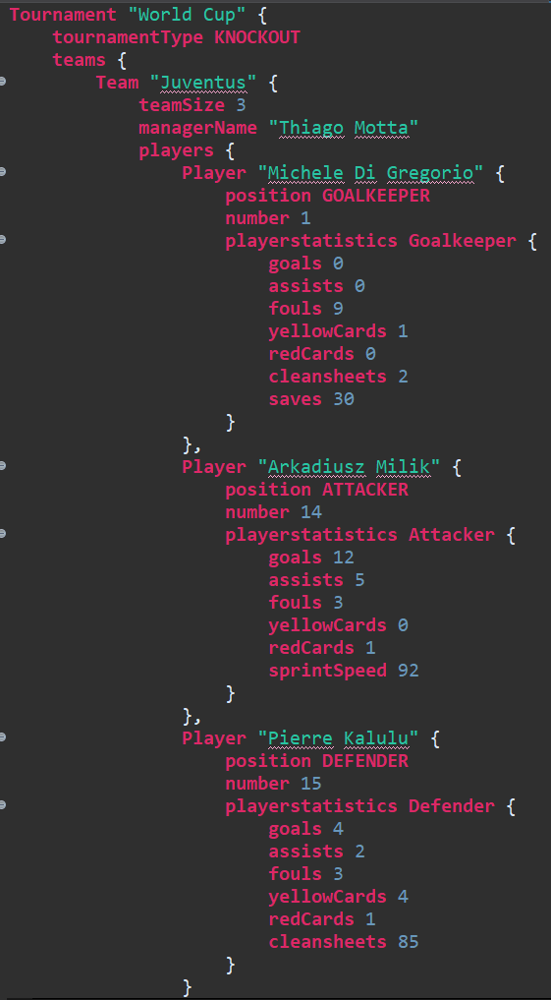
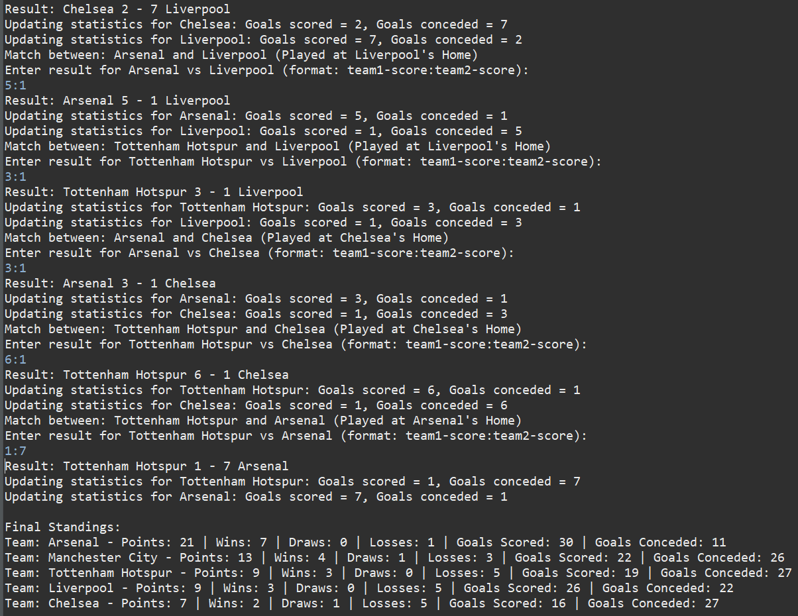
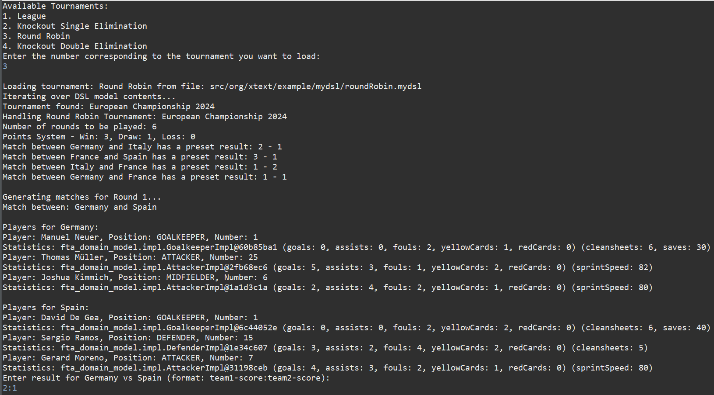

# Final Project
A project by: Oskar Aaltvedt Høgseth, Martin Hegnum Johannessen, David Duc Lam, Daniel Lønning & Daniel Pietrzykowski Sarjomaa

---

This project is part of the [TDT4250 - Model-Driven Software Engineering course](https://www.ntnu.edu/studies/courses/TDT4250), Fall Semester 2024, at NTNU, Trondheim. The project builds upon the recommendations provided by Leonardo in _Assignment 2 - Football Tournament Application (Metamodel)_. The objective of this project is to design and implement a metamodel that represents core concepts and relationships within the chosen system. 

The project uses the Eclipse Modeling Framework (EMF) and Ecore modeling techniques. It features an Ecore metamodel for entities such as Teams, Players, Matches, and Tournaments. Constraints and derived features are implemented to ensure correctness. Representative model instances are created to demonstrate various configurations. A textual DSL editor, built with Xtext, links the DSL to application behavior via a code generator or interpreter. The final solution is packaged as Eclipse plugin to provide a reusable and scalable approach to tournament management.

---

# Table of content 
- [Domain Model Overview](#domain-model-overview)
- [Repository Structure](#repository_structure)
- [Installation and Setup](#instillation_and_setup)
    + [Prerequisites](#prerequisites)
    + [Setup Instructions](#setup_instructions)
- [Changes Made](#changes_made)
    + [Fixed Small Corrections in .aird Model](#fixed-small-corrections-in-aird-model)
    + [Implemented OCL Constraints](#implemented_ocl_constraints)
    + [Creating 3 Instances of the Metamodel](#creating_3_instances_of_the_metamodel)
- [TournamentDSL Guide](#tournamentdsl-guide)
    + [Overview](#overview)
    + [Syntax Guide](#syntax-guide)
       + [1. Tournament Definition](#1-tournament-definition)
       + [2. Teams Section](#2-teams-section)
       + [3. Tournament Format](#3-tournament-format)
       + [4. Matches Section](#4-matches-section)
    + [Constraints](#constraints)
    + [Tournament Example](#tournament-example)
    + [Common Mistakes to Avoid](#common-mistakes-to-avoid)
- [Development Insights](#development_insights)
    + [Overambitious Generalization](#overambitious-generalization)
    + [Defining Comprehensive Constraints](#defining-comprehensive-constraints)
    + [Variability Handling](#variability-handling)
- [Future Work](#future_work)
    + [Maven Integration for Dependency Management](#maven-integration-for-dependency-management)
    + [Graphical DSL Editor with Sirius](#graphical-dsl-editor-with-sirius)
    + [External API Integration for Data](#external-api-integration-for-data)
<br>

---

# Domain Model Overview
The Football Tournament Application (FTA) metamodel comprises the structure and logic of a football tournament system. It is designed to emphasize the relationships between core entities, abstract classes, and inheritance to maximize reusability and maintainability.

The following are the main components of the metamodel:
- Tournament: represents the high-level organization of the tournament.
- Team: represents football teams.
- Player: represents players within a team.
- Match: represents teams participating in a match and scores.
- Tournament Format: represents supported formats. The formats consist of `RoundRobin` (points-based), `SingleElimination` (rounds with optional third-place playoff), and `DoubleElimination` (upper/lower brackets with finals format).
- Player Statistics: represents individual player performance metrics. Additional position-specific metrics are defined in the subclasses.
- Match Rules: represents configurable rules for matches. The rules include `PenaltyShootouts`, `GroupStage`, and `ExtraTime` and `Standard`.

<div align="center">
    
    <br>
    <em>Figure: Domain Model illustrating the structure and relationships within the Football Tournament Application</em>
</div>

# Repository Structure
- [Final Project Group01](https://github.com/TDT4250-IDI/final-project-group01)

    The project is structured as follows:
    * `model/`: Contains the Ecore model, generated code, and example model instances.
    * `src/`: Java code generated from the metamodel, including base functionality for the FTA.
    * `tests/`: JUnit 5 test cases for validating constraints and derived features.
    * `README.md`: Documentation of the project, including setup instructions and features.

- [org.xtext.examples.mydsl]

    The Xtext project, containing the DSL for creating tournament configurations.

    * `src/`
        * `/instancesDSL/` contains .mydsl files for each tournament type
            * `KnockoutDoubleElim.mydsl` Copy of KnockoutDoubleElim.mydsl from runtime instance
            * `KnockoutSingleElim.mydsl` Copy of KnockoutSingleElim.mydsl from runtime instance
            * `RoundRobin.mydsl` Copy of RoundRobin.mydsl from runtime instance
            * `league.mydsl` Copy of league.mydsl from runtime instance

        * `org.xtext.examples.mydsl/` contains .xText file for DSL
            * `MyDsl.xtext` .Xtext file based of our Ecore metamodel
            
        * `org.xtext.examples.mydsl.generator/` contains .xtend file for DSL generator
            * `KnockoutHandlerDSL.xtend` Handler for Knockout
            * `LeagueHandlerDSL.xtend` Handler for League
            * `MyDslGenerator.xtend` Failed attempt at creating DSL to Xtend generator
            * `RoundRobinHandlerDSL.xtend` Handler for Round Robin
            * `TournamentGeneratorDSL.xtend` Main class for DSL generator
    

- [org.xtext.examples.mydsl.ide]
- [org.xtext.examples.mydsl.tests]
- [org.xtext.examples.mydsl.ui.]
- [org.xtext.examples.mydsl.ui.tests]

# Repository

# Installation and Setup
## Prerequisites
* Java Development Kit (JDK) 11 or higher.
* Eclipse IDE with the following plugins:
   * Eclipse Modeling Framework (EMF)
   * Xtext for DSL editor functionality
   * JUnit 5

## Setup Instructions
1. Clone the Repository:

```
git clone <https://github.com/TDT4250-IDI/final-project-group01>
cd final-project-group01
```

2. Import into Eclipse:

Open Eclipse and import the project via File -> Import -> Existing Projects into Workspace or Projects from Folder or Archive.

## Changes Made

### Fixed Small Corrections in .aird Model

In Assignment 2, "Football Tournament Application (Metamodel)," we identified several minor mistakes in the class diagram. Aiming to minimize changes, we adjusted what was necessary to achieve a functional metamodel.

First, we found incorrect relationships between entity classes. By modifying some relationships, we improved the metamodel's structure.

Second, each class contained too many variables. Reducing the number of variables to a reasonable level made the metamodel easier to comprehend.

Additionally, some relationships had incorrect lower and upper bounds, an issue that became apparent while creating a new DSL metamodel. After correcting these bounds, we implemented a partially correct metamodel, which facilitated the development of a working application.

Finally, we focused on refining the attributes in each class to ensure they had the correct properties. The code we generated and implemented ourselves allowed us to assign appropriate values to the metamodel's attributes. For example, we correctly assigned IDs to different classes. Our goal was for the attributes to hold precise values that aligned with the application's minimalistic structure.

### Implemented OCL Constraints

For the next step, we implemented OCL constraints to restrict metamodel faults and possible errors that our system wouldn't comprehend. The OCL constraints we added were:

- `uniqueTeams`
- `validTeamRange`
- `teamSizeConstraint`
- `teamTotalGoalsConstraint`
- `validExtraTime`

To test this, we used JUnit 5, running tests within the folder `test/tests`. The following image shows the results of our tests.

<div align="center">
    
    <br>
    <em>Figure: Tests Results</em>
</div>

### Creating Instances of the Metamodel

Our project focused on football tournament metamodels. We developed metamodels for different tournament types, each with its own match rules and teams. Specifically, we created FTA metamodels for:

- **Knockout**
- **League**
- **Round Robin**

Using the tournament generator (`tournamentGenerator.xtend`) built with Xtend and the generated Java code, we extracted XMI files from our metamodel. This extraction was the foundation for generating textual outputs from model instances. These textual instances were then used to create references in both the FTA application and our Xtext models.

Running the generated Java code (`xtend-gen/generators/tournamentGenerator.java`) allowed us to create match results in the console. For each match, you input the scores, and the generator outputs whether the result is a win, loss, or draw. After all matches are completed, the generator prints the final tournament results.

Next, we created an Xtext project based on our Ecore metamodel to achieve the same outcome using our Xtext model.

The following images illustrate the complete domain models for three different types of football tournaments.

<div align="center">
    <table>
    <tr>
        <th>Knockout Tournament</th>
        <th>League Tournament</th>
        <th>Round Robin Tournament</th>
    </tr>
    <tr>
        <td></td>
        <td></td>
        <td></td>
    </tr>
    <tr>
    </tr>
    </table>
</div>

### Creating the Xtext Project

We converted our existing EMF project to Xtext, which generated a new Xtext project based on our metamodel. This process created five new project folders:

- `org.xtext.examples.mydsl`
- `org.xtext.examples.mydsl.ide`
- `org.xtext.examples.mydsl.tests`
- `org.xtext.examples.mydsl.ui`
- `org.xtext.examples.mydsl.ui.tests`

The `org.xtext.examples.mydsl` folder contained the essential files for our project, including:

- `MyDsl.xtext`
- `GenerateMyDsl.mwe2`
- `org.xtext.examples.mydsl.generator/MyDslGenerator.xtend`

We made some adjustments to the `MyDsl.xtext` file, fixing type errors and realigning parser rule variables to match the metamodel.

Running "Generate Xtext Artifacts" on the `MyDsl.xtext` file created a fully functional DSL environment tailored to our specifications.

### Creating the DSL File

The final step was to create a DSL file using the Xtext editor. Launching the runtime instance of Eclipse allowed us to create a DSL folder with different `.mydsl` files. Naming the files with the `.mydsl` extension enabled syntax highlighting and proper project building.

Using the Xtext editor, we created three different DSL files, each reflecting a different aspect of our Ecore model.

The following images display the DSL files in the Xtext editor.

<div align="center">
    <table>
    <tr>
        <th>Tournament DSL Sidebar View</th>
        <th>Tournament DSL View</th>
    </tr>
    <tr>
        <td></td>
        <td></td>
    </tr>
    <tr>
    </tr>
    </table>
</div>


  

### Extracting the `.mydsl` Content

We explored various methods to extract the DSL files into XMI format for textual output based on our Xtext syntax.

Our first attempt was to create a DSL generator (`MyDslGenerator.xtend`) using Xtend. This generator produced an Xtend file from our `.mydsl` file, printing its content. However, this approach was simple but not very effective.

The final solution involved copying the content from each `.mydsl` file and creating handler classes for each tournament type:

- `KnockoutHandlerDSL.xtend`
- `LeagueHandlerDSL.xtend`
- `RoundRobinHandlerDSL.xtend`

We then created a main class to run the appropriate handler based on the selected tournament type:

- `TournamentGeneratorDSL.xtend`

Running this main class allowed us to create the same textual interactions as before, resulting in an interactive DSL environment where users can input their own results.


The images below display the Xtend-generated output visualized in the console.

<div align="center">
   <table>
    <tr>
        <th>Tournament Selection (Xtend to Console)</th>
        <th>Tournament Input (Xtend to Console)</th>
    </tr>
    <tr>
        <td></td>
        <td></td>
    </tr>
    <tr>
    </tr>
    </table>
</div>

# TournamentDSL Guide

## Overview
TournamentDSL is a domain-specific language that has been designed for defining and managing the different types of football tournaments. These include Knockout (Single- and Double Elimination), League, and Round Robin. The DSL was initially generated through Xtext, then customized to do necessary changes.

Customizations include:
- Simplification of element definitions, allowing direct use of class names.
- Flexibility in the ordering of elements within their parent structures.
- The addition of `tournamentType` to differentiate tournament structures directly in the DSL.

A TournamentDSL file organizes a tournament's structure into the sections:
- Tournament
    - Tournament format
    - Teams
        - Players
            - Statistics
    - Brackets
        - Match
            - Rules

## Syntax Guide

### 1. Tournament Definition
Begin with defining the tournament, specifying the type and basic details:

```dsl
Tournament "World Cup" {
    tournamentType KNOCKOUT
    // Additional configurations follow...
}
```

### 2. Teams Section

Define teams participating in the tournament, including details about the players:

```dsl
teams {
    Team "Juventus" {
        teamSize 3
        managerName "Thiago Motta"
        players {
            Player "Arkadiusz Milik" {
                position ATTACKER
                number 14
                // More player statistics...
            }
            // Additional players...
        }
    }
    // Additional teams...
}
```

### 3. Tournament Format

Specify the format of the tournament, such as knockout, league, or round robin:

```dsl
tournamentformat Knockout "Knockout" {
    maxTeams 16
    minTeams 4
    description "Single-elimination knockout stage"
    numberOfRounds 4
}
```

### 4. Matches Section

Organize matches within brackets, detailing each game's outcomes and rules:

```dsl
brackets {
    Bracket {
        rounds 1
        bracketSide UPPER
        matches {
            Match {
                scoreTeam1 2
                scoreTeam2 1
                matchResult WIN
                day 2021-02-01
                teams ("Juventus", "Barcelona")
                matchrules Standard
            }
            // Additional matches...
        }
    }
    // Additional brackets...
}
```

## Constraints
* Each team must have defined players with roles and stats.
* Matches must specify results and conform to the defined tournament rules.
* The tournamentType must align with the structures defined in the DSL (e.g., KNOCKOUT, LEAGUE).

## Tournament Example

```mydsl
Tournament "Mini World Cup" {
    tournamentType ROUND_ROBIN
    teams {
        Team "Brazil" {
            teamSize 11
            managerName "Carlos Silva"
            players {
                Player "Roberto Carlos" {
                    position DEFENDER
                    number 6
                }
                // Additional players...
            }
        }
        Team "Argentina" {
            teamSize 11
            managerName "Miguel Juarez"
        }
    }
    tournamentformat RoundRobin "Group Stage" {
        maxTeams 4
        minTeams 3
        description "Each team plays each other once"
        numberOfRounds 3
    }
    brackets {
        Bracket {
            matches {
                Match {
                    scoreTeam1 1
                    scoreTeam2 1
                    matchResult DRAW
                    teams ("Brazil", "Argentina")
                }
                // More matches...
            }
        }
    }
}
```

## Common Mistakes to Avoid
* Incomplete Team Details: Ensure every team has at least two players and one manager.
* Misconfigured Tournament Formats: Match the tournamentType with appropriate tournamentformat settings.
* Incorrect Match Results: Verify match outcomes align with the actual game results and tournament rules.


# Development Insights

## Overambitious Generalization
Initially, we planned to generalize the application from a football tournament to a sports tournament management system. This would allow for broader use cases across multiple sports. However, the increased complexity in defining universal constraints and attributes for all sports made this approach infeasible. The constraints required for specific sports (e.g., football vs. tennis) were too diverse, and maintaining consistency became overwhelming. Thus, we narrowed the scope back to a football tournament management application, focusing on specific domain constraints and features.

## Defining Comprehensive Constraints
Defining constraints that balanced domain accuracy and implementation feasibility was challenging. Some constraints (e.g., `teamSizeConstraint`) required simplifying assumptions. The complexity of constraints increased with variability in model instances. While functional, the constraints could benefit from more comprehensive definitions to handle edge cases and specific domain rules.

## Variability Handling
The significant variability introduced created challenges in generating meaningful test cases. This made data creation and testing more time-consuming than anticipated. Despite the challenges, we successfully created three representative instances of the metamodel. These instances demonstrate the functionality but are not exhaustive.

## Maven Integration for Dependency Management
To streamline dependency management and automate builds, Maven was opted to use. During the Maven integration, we encountered issues with Git that led to discrepancies in our original project. These conflicts, particularly concerning project setup and plugin dependencies, hindered successful integration. Future work should focus on resolving these conflicts.